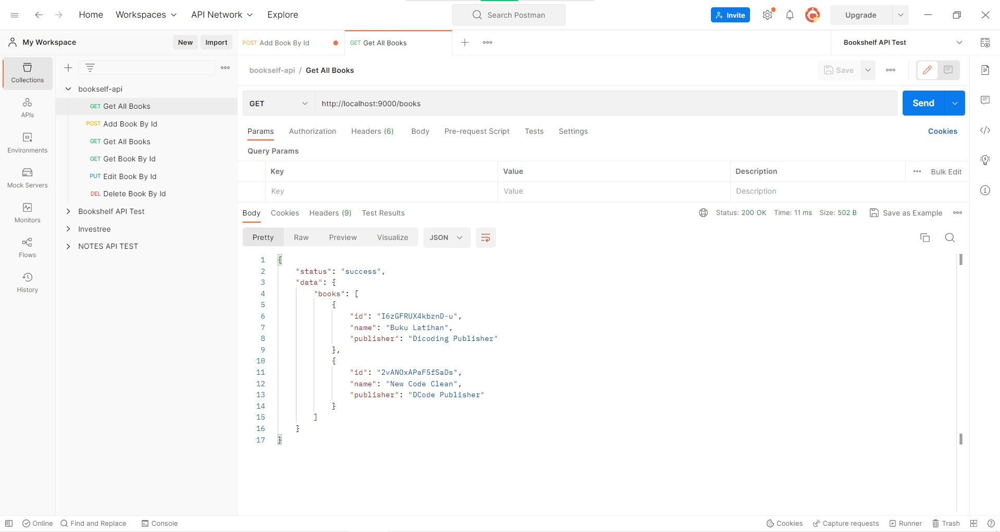
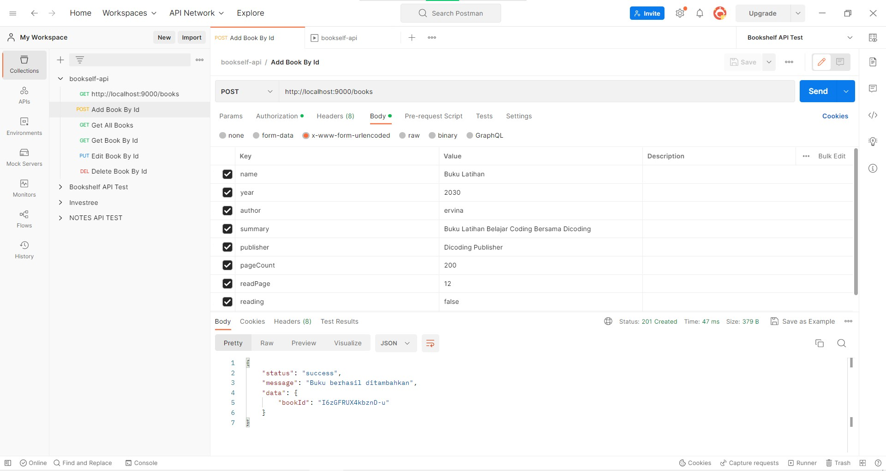
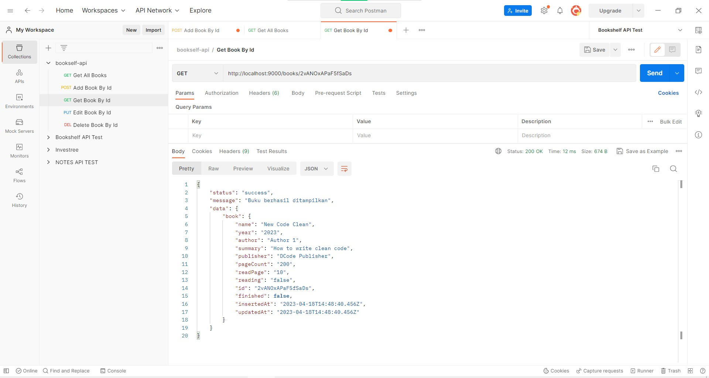
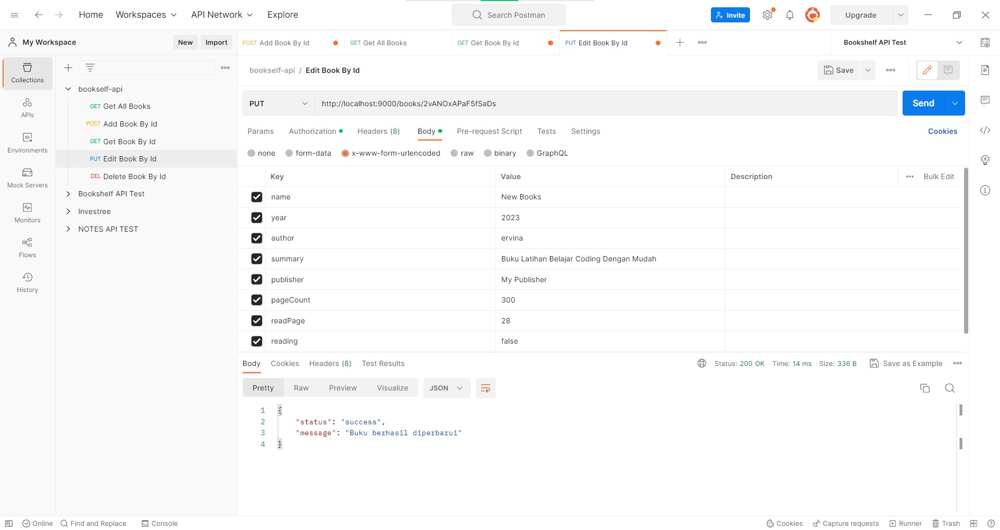
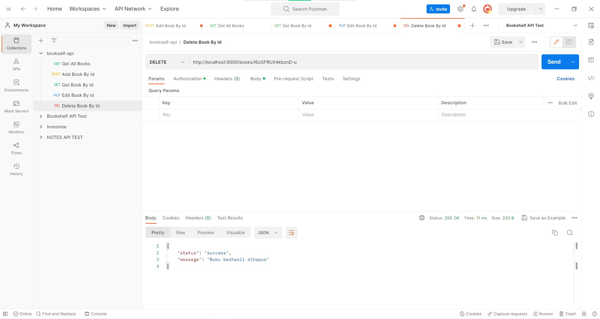

# BOOKSHELF Restful API 

This is a RESTFULL API for managing a bookshelf.

## How To Use
### Build With
- node.js  v16.9.1
- @hapi/hapi version : "^21.3.0"
- nanoid version : "^3.3.4"
- nodemon version : "^2.0.21"

### Installation
1. Clone the repository

```
git clone https://github.com/ervinanovlianti/bookself-restful-api.git
```

2. Install dependencies
``` 
cd bookself 
npm install 
```

3. Start the server
``` 
npm run start-dev 
``` 
Server will running at port ``` http://localhost:9000 ```

### Usage
Once the server is running, you can test the API using an HTTP client like Postman.

## API Endpoints
### GET /books
Returns a list of all books. <br>


### POST /books
Adds a new book. <br>


### GET /books/:id
Returns a single book with the specified ID. <br>


### PUT /books/:id
Updates a book with the specified ID. <br>


### DELETE /books/:id
Deletes a book with the specified ID. <br>


## Folder Structure
```
├── src
    ├── books.js
    ├── handler.js
    ├── routes.js
    └── server.js
├── eslint.json
├── package-lock.json
├── package.json
└── readme.md
```

## Contact
You can contact me by e-mail: ervinanovliantii@gmail.com or [Linkedin](https://www.linkedin.com/in/ervina-novlianti/).
